# 🍄 Projet de groupe 2024 sur la reconnaissance de champignons 🍄

> Auteurs : *[Heuzef](https://heuzef.com), Yvan Rolland, Viktoriia Saveleva, Florent Constant*

---

# Rendu N°1 : Rapport d’EDA

> Date : *06/2024*

# 1. Introduction

La compréhension des champignons est cruciale pour la préservation de la biodiversité, la santé humaine et l'agriculture durable.

Les champignons ne sont pas des plantes, bien que leur apparente immobilité puisse le faire penser. Une distinction simple est que les champignons ne font pas de photosynthèse, contrairement à une majorité de plantes. En fait, dans l'arbre de la vie, les champignons sont plus proches des animaux que des plantes bien que leur mode de nutrition, paroi cellulaire, reproduction, les distingues également nettement des animaux.

L'arbre de la vie, qui représente la parenté entre les organismes vivants, peut être découpé en six règnes. Les champignons représentent rien qu'à eux le règne fongique, qui rassemblerait hypothétiquement jusqu'à 5 millions d'espèces de champignons. Parmi toutes ces espèces, environ seulement 120 000 ont été nommées et “acceptées” par la communauté scientifique [en 2017](https://onlinelibrary.wiley.com/doi/abs/10.1128/9781555819583.ch4).

La reconnaissance de champignons représente un défi dans le domaine de la vision par ordinateur. En effet, les critères biologiques et le peu d'espèce référencés limite à une reconnaissance peu fiable et sur un échantillon insignifiant si l'on souhaite étudier l'ensemble du règne fongique.

La classification classique des vivants est schématisée ainsi :

| Classification classique des règnes |
|:-----------------------------------:|
| Animal                              |
| Plante                              |
| **Champignon (Fungi)**              |
| Protiste                            |
| Bactérie                            |
| Archée                              |

Et les principaux rangs taxonomiques ainsi (ici, un exemple de classification du très connu "*Champignon de Paris*") :

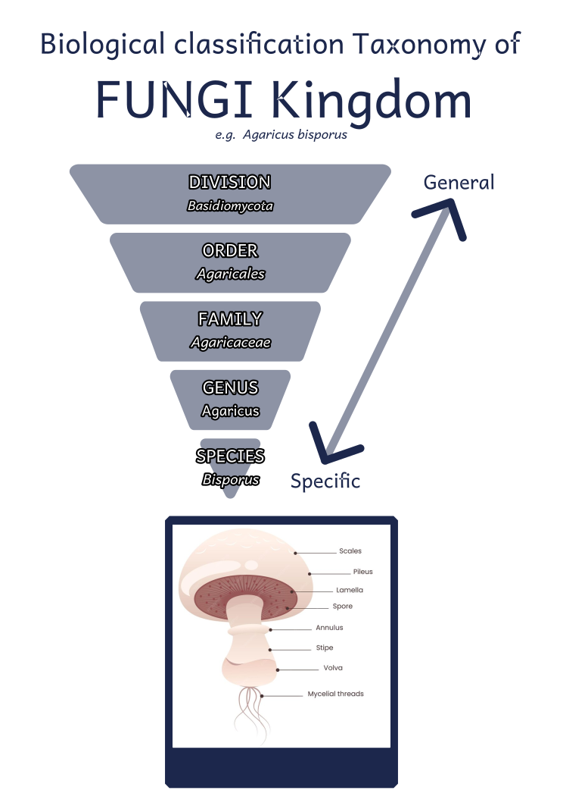

On y voit que les champignons sont classés (du plus général au plus spécifique) en divisions, ordres, familles, genres et espèces.

L'état de l'art nous apprend que la reconnaissance des champignons au sens large ne sera possible que sur un échantillon très faible du règne fongique, mais ce n'est pas tout, en effet, la vision par ordinateur effectue un balayage des images matricielle pour comparer les similitudes pour chaque pixel avec des images déjà labellisé, ainsi, nous dépendons de la qualité des sources de donnés, qui ne représentent qu'un échantillon des ~120 000 espèces scientifiquement nommées sur un total pouvant aller jusqu'à 5 millions d'espèces théorique.

Il existe également la distinction entre macro-champignons et micro-champignons, qui se base sur une combinaison de caractéristiques morphologiques, cellulaires, reproductives, écologiques et économiques. L'identification précise des champignons exige des connaissances approfondies en mycologie. Par ailleurs les différentes sources alertent quand à la difficulté de l'identification d'une espèce se basant uniquement sur l'aspect visuel.

À ce jours, il existe approximativement 35000 genres et de champignon sur terre et certain peuvent compter jusqu'à des milliers espèces nommés, tandis que d'autre peuvent n'en compter qu'une seul.

Une analyse visuelle des différents rangs taxonomiques sur des échantillons de photos extraite de Mushroom Observer nous laisse penser que c'est au niveau de l'espèce que nous pouvons observer les plus de traits caractéristiques en vue de réaliser une identification visuelle :

### Visuel par ordre :

Des champignons appartenant à l'ordre des PEZIZALES :

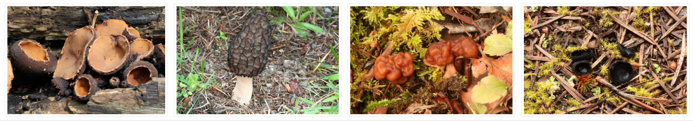

### Visuel par famille :

Des champignons appartenant à la famille des RUSSULACEAE : 

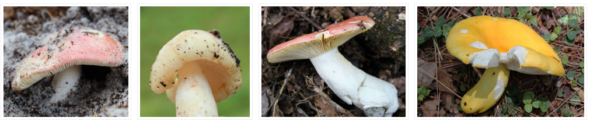

### Visuel par genre :

Des champignons du genre CANTHARELLUS :

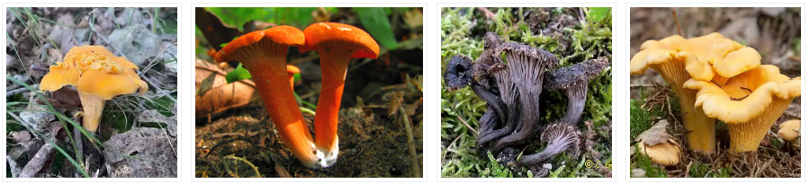

### Visuel par espèce :

Des champignons appartenant à l'espèce HYPHOLOMA LATERITIUM :

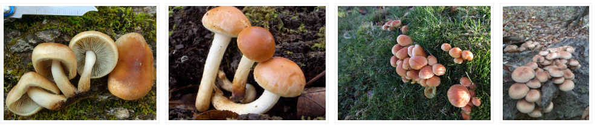

C'est également communément le niveau d'identification recherché car c'est au niveau de l'espèce que sont définies les principales propriétés d'un champignon, telles que la comestibilité.

Nous constatons également que les champignons peuvent avoir des formes si variées que deux champignons de la même espèce peuvent avoir un aspect très différent (notamment en fonction de l'age), alors que deux champignons d'espèces différentes peuvent afficher une très forte ressemblance.

### Variétés de formes dans une même espèce

Pour illustration, deux champignons de l'espèce Coprinus comatus mais visuellement très différents :

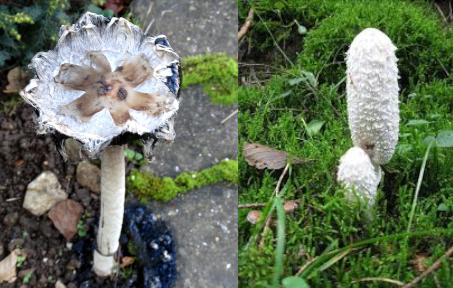

### Confusions possibles

De même deux champignons de genres différents visuellement difficiles à distinguer, ici Clytocibe nébuleux et Entolome livide :

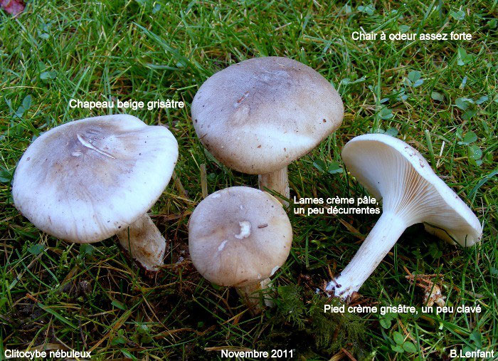

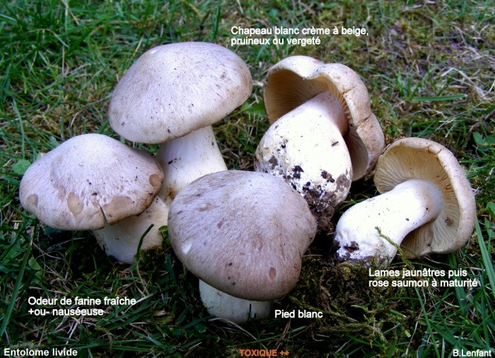

# 2. Objectif

Ce premier niveau de connaissance de la problématique d'identification visuelle d'un champignon nous permet de distinguer trois difficultés majeures du domaine : 

1. L'immense quantité d'espèces existantes, la proximité visuelle importante existant entre certaines espèces et la différence morphologique pouvant exister au sein d'une même espèce.

2. La quantité et la qualité des données disponibles seront déterminantes pour obtenir un modèle performant.

3. Selon nos propres capacités et le temps disponible pour la réalisation du projet, nous pourrons fixer différents niveaux d'objectifs à atteindre pour notre projet, l'essentiel restant l'aspect pédagogique et l'acquisition de compétences.

L'objectif primaire est d'entraîner un modèle pour la reconnaissance des champignons. Pour atteindre cet objectif, il faudra suivre les étapes suivantes :

1. Analyser la taxonomie et définir le niveau sur lequel nous concentrer

2. Analyser les données disponibles

3. Trier et filtrer les données

4. Data augmentation (créer de nouveaux échantillons d'entraînement en appliquant diverses transformations aux images existantes)

5. Prétraitement des données

6. Poursuivre avec des techniques de deep learning

Nous pourrons donc travailler à entraîner un modèle capable d'identifier un nombre plus ou moins grand d'espèces avec le plus de précision possible. Le niveau de difficulté pourra donc être modulé selon le nombre d'espèces introduites mais aussi la ressemblance visuelle entre les différentes espèces introduites.

Nous pourrons également envisager différentes approches, par exemple entraîner et utiliser un modèle pour faire du "boxing", générer des données artificielles par des transformations des images de notre jeu de données, essayer de quantifier le volume d'images nécessaire pour l'obtention d'un certain niveau de performances ...

# 3. Sources de données identifiées

Les ensembles de données contenant des champignons sont largement utilisés pour l'entraînement des algorithmes de machine learning et de deep learning. Divers ensembles de données sont disponibles en accès libre pour différentes finalités.

**UC Irvine Mushroom Database** (https://archive.ics.uci.edu/dataset/73/mushroom) comprend 8 124 enregistrements de données et 22 attributs. Chaque espèce de champignon est identifiée comme une classe de champignons comestibles ou toxiques. Ces données sont réparties en 4 208 champignons comestibles et 3 916 champignons toxiques. De nombreuses approches différentes sont présentées dans la littérature pour travailler avec ce type de caractérisation des champignons basée sur les caractéristiques physiques (pas d'images). Cependant, dans ce travail, nous nous concentrons principalement sur la reconnaissance d'images, notre attention se portant sur les ensembles de données d'images.

### Mushroom Observer

[Mushroom Observer](https://mushroomobserver.org) est un site web où les gens peuvent télécharger des observations de champignons. Ces observations incluent différentes informations sur l'espèce observée, comme le nom, l'emplacement, et la certitude concernant l'espèce sur les images soumises. Le site est basé sur des photos prises par un grand nombre d'individus qui ne sont pas nécessairement des experts dans ce domaine. La certitude des étiquettes de classe, donnée par la communauté est sur une échelle continue de 1 à 3 (où 3 représente le plus haut niveau de certitude).

L'analyse des images de Mushroom Observer montre deux problèmes principaux liés à :

1) **la qualité des images**. Il y a beaucoup d'images qui ne sont pas exploitables : schémas, clichés microscopiques, etc ...

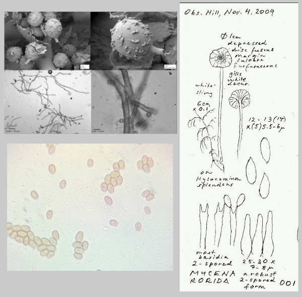

*Exemples de photos inexploitables*

2) **le niveau de fiabilité de l'attribution de classe.** Le système de vote pour la classification des champignons ajoute de l'incertitude dans l'attribution de classe.

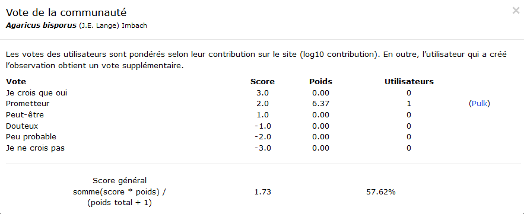

Ainsi, la base de données ne peut pas être utilisée telle quelle à partir du site web et doit être filtrée.

### MO106 Database

En analysant la littérature utilisant l'ensemble de données Mushroom Observer, nous avons trouvé une base de données MO106 [disponible en accès libre](https://keplab.mik.uni-pannon.hu/en/mo106eng) où les auteurs ont sélectionné 106 classes de champignons de Mushroom Observer en utilisant les critères suivants : espèces ayant au moins 400 images, images avec certitude ≥ 2. De plus, pour filtrer automatiquement les images afin d'obtenir une image correcte de champignon (sans objets supplémentaires ou sans champignons), les auteurs ont [formé un modèle CNN spécifique](https://ieeexplore.ieee.org/document/9552053).

Cela a abouti à un ensemble de données MO106 contenant 29 100 images réparties en 106 classes. La plus grande classe compte 581 éléments, la plus petite 105, avec une moyenne de 275. Les images, disponibles gratuitement pour le téléchargement, ont des tailles variant entre 97 × 130 (plus petite surface) et 640 × 640 (plus grande surface).

Pour une observation nous obtenons :

*   Photos
*   Genre et espèces

### Mushrooms classification - Common genus's images

[Dataset de champignons basés sur des images](https://www.kaggle.com/datasets/maysee/mushrooms-classification-common-genuss-images/data).

Cet ensemble de données contient 9 dossiers d'images des genres de champignons les plus communs du nord de l'Europe (Agaricus, Amanita, Boletus, Cortinarius, Entoloma, Hygrocybe, Lactarius, Russula et Suillus). Chaque dossier contient entre 300 et 1 500 images sélectionnées de genres de champignons. Les étiquettes correspondent aux noms des dossiers. Des codes de classification utilisant cet ensemble de données sont également disponibles.

L'avantage de cette base de données par rapport à Mushroom Observer est que la classification a été vérifiée par la société de mycologie d'Europe du Nord, qui a fourni les sources des champignons les plus communs de cette région et a vérifié les données et les étiquettes.

Pour une observation nous obtenons :

*   Photos
*   Genre et espèces

### MycoDB

Le site [mycodb.fr](https://www.mycodb.fr) nous permet d'acquérir des caractéristique précises d'un champignon identifié via un nom binominal, pour une observation nous obtenons :

*   Photos
*   Division - Classe - Ordre - Famille
*   Synonymes
*   Chapeau
*   Lames
*   Stipe
*   Saveur
*   Odeur
*   Couleur de la sporée
*   Ecologie
*   Comestibilité
*   Références bibliographiques

### Wikipedia

[Wikipédia](https://fr.wikipedia.org) reste une source d'information très complémentaire et souvent exhaustive pour en apprendre plus sur un genre ou une espèce de champignon.

## Conclusion

Après identification de ces différentes sources de données nous concluons que Mushroom Observer sera celle qui sera la plus exploitable pour obtenir des données de qualité. Le site dispose d'une API permettant un accès à la quasi totalité des données, permettant d'obtenir une visualisation précise du nombre d'espèces répertoriées ainsi que du nombre d'observations et d'images associées à chaque espèce.

Par ailleurs le jeu de données MO106 déjà extraites de Mushroom observer pourrait être une source inintéressante car déjà prête à l'emploi bien que la qualité des images sélectionnée échappe à notre contrôle. Cela pourra par exemple donner lieu à un comparatif de précision des résultats en fonction de la qualité des images en entrée.

# 4. Exploration approfondie des données disponibles sur Mushroom observer

Le principal avantage de Mushroom observer est qu'il met à disposition une API permettant d'accéder a des données structurées issues de sa base. Ces données nous permettrons de faire une analyse qualitative et quantitative des images disponibles. Les données ont été téléchargées au format CSV et sont présentes sur le dépôt du projet.

## Principales tables

### table names

Cette table contient l'arborescence des nommages disponibles sur le site, répartis en niveaux (rangs) de la manière suivante :

1. forme
2. variété
3. sous-espèce
4. espèce
5. stirpes
6. sous-section
7. section
8. sous-genre
9. genre
10. famille
11. ordre
12. classe
13. phylum
14. regne
15. domaine
16. groupe

Nous observons par exemple que le site répertorie à ce jour 56161 espèces.

### table observations

Cette table permet de quantifier le nombre d'observations réalisées pour chaque espèce mais aussi de qualifier la fiabilité de ces observations : le site offrant un système participatif, l'identification des champignons est soumise au vote des utilisateurs du site. La note de confiance concernant l'identification d'une observation varie de -3 à 3. Après évaluation du nombre d'observation disponible nous choisirons de ne conserver que celles dont le score de confiance est >= 2.

Le graphique montre que le jeu de donnée comprends environs 150k observations rattachées à une espèce avec un niveau de confiance >= 2.

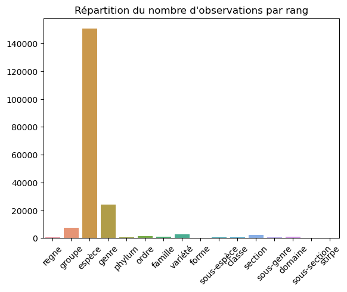

### table images_observation

Cette table liste les images rattachées à chaque observation. Sans surprise les quantités d'images rattachées à chaque rang sont proportionnelles a la quantité d'observations. Nous constatons que pour notre sélection de critères environs 500k images sont disponibles.

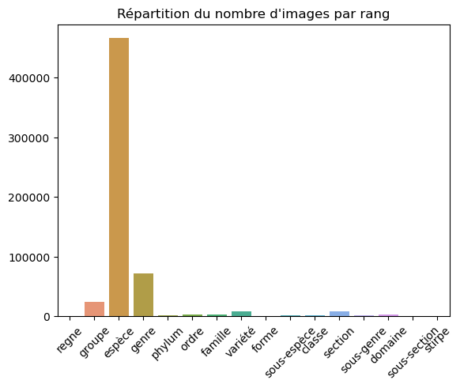

## Agrégation par espèces

Nous savons que nous devons disposer d'une quantité minimale d'images pour chacune des espèces sur lesquelles nous souhaitons entraîner notre modèle. Bien que cette quantité soit encore à définir précisément, nous estimons que 150-250 images serait une base de départ viable. Nous constatons aussi que la moitié environs des images est exploitable, le reste n'étant pas directement des photographie des spécimens de champignons. 

Un second filtrage est effectué pour ne sélectionner que les espèces qui disposent d'au moins 500 photos sur le site. Nous pouvons donc compter disposer de données suffisantes pour 129 espèces.

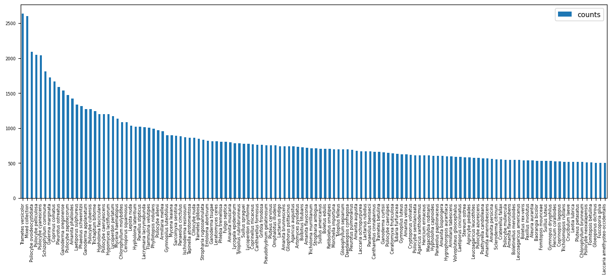

## Sélection finale des images

Nous avons identifié le besoin de filtrer manuellement les images avant pré-traitement pour exclure celle qui ne sont pas exploitables (schémas, clichés microscopiques, etc ...). Nous avons donc réalisé un outil proposant une interface permettant de réaliser le tri de manière relativement efficace. Nous pourrons constituer un jeu de données d'images triée plus ou moins important selon les besoins et le temps disponible au fil de l'avancée du projet.

L'outil est disponible sur le dépôt du projet.


Une fois la sélection effectuée, nous pouvons alors exécuter le script de webscraping nous permettant de télécharger les photos sélectionnés *(cf: Annexes)*. Pour certains champignons, nous avons plus d'une photo. Nous nous concentrons uniquement sur la première (le script sélectionne uniquement la première image de la série).

A la date de rédaction de ce rapport nous avons réuni 2282 images appartenant à 14 espèces différentes.

## Organisation des données

Le stockage des données, (dans espace de stockage privé), est structurée ainsi :

```
data
├── LAYER0
│   ├── MO
│       ├── MO
│   │   └── dataset.csv
│   └── MO_106
│       ├── MO_106
│       ├── class_stats.csv
│       ├── dispersion.csv
│       └── image_stats.csv
├── LAYER1
│   └── MO
│       └── MO
└── LAYER2
    └── MO
        └── MO
```

> Cette configuration nous permettra ultérieurement de fournir la base d'image MO ou MO_106 à nos différent modèles facilement.

# 5. Pré-traitement des données

## Choix des outils de preprocessing

Pour le prétraitement des données, nous avons sélectionné des outils spécifiques de preprocessing. Ensuite, nous appliquons un second traitement avec le modèle YOLOv5 (You Only Look Once version 5), qui permet une détection rapide et précise des champignons en les identifiant par encadrement *(cf: Annexes)*.

Cela nous permet d'obtenir des images précise indispensables pour les étapes suivantes d'entraînement de modèle. Cet outil n'étant pas parfait, nous compensons les échecs de celui-ci avec un outil d'encadrement manuel développé pour l'occasion *(cf: Annexes)*.

Afin de préparer nos images pour les entraînements à venir, nous appliquons les méthodes conventionnelles et récurrentes pour le CNN.

## Redimensionnement des images

La réduction des images à une taille de 224 x 224 pixels est couramment utilisée dans les architectures de réseaux de neurones convolutionnels (CNN) pour plusieurs raisons pratiques et techniques tel que la standardisation, la gestion de la mémoire et des ressources computationnelles, la comparaison avec les modèles pré-entraînés et la capture des caractéristiques importantes.

## Enrichir le jeu de données

Nous réalisons une étape de ré-échantillonnage afin d'augmenter le volume de données d'entraînement, pour les futurs modèles que nous testerons. Cela nous permettra d'améliorer la précision des modèles.

Nous avons réalisé un script exploitant ImageDataGenerator de la librairie tensorflow.keras.preprocessing.image *(cf: Annexes)*.

Nous effectuons ainsi l'augmentation des données avec les techniques suivantes :

- Rotations

- Retournement horizontal

- Retournement vertical

- Cisaillements

Cela permet de créer de nouveaux échantillons d'entraînement à partir des images existantes, augmentant ainsi la robustesse et la capacité de généralisation de notre modèle.

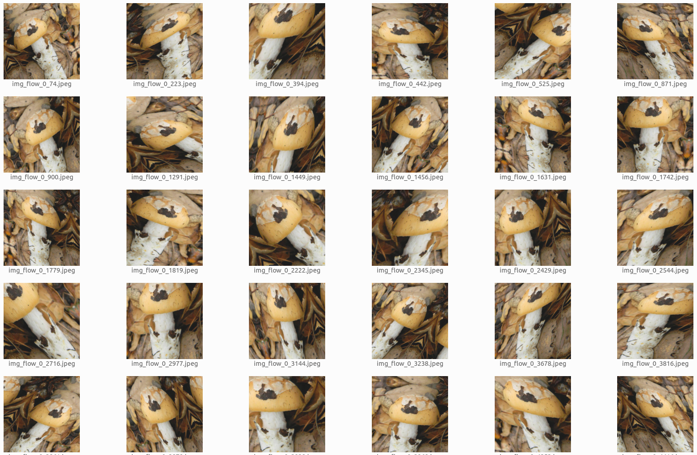
*Exemple d'images enrichies générée depuis une unique image source, à l'aide de la classe ImageDataGenerator de Keras.*

# 6. Conclusion

Ce rapport nous permet d'avoir un aperçu de la complexité de la reconnaissance de champignons, mettant en lumière les défis et les opportunités qui se présentent dans ce domaine. À travers une exploration détaillée de la taxonomie, des sources de données disponibles et des étapes de prétraitement des données, nous avons identifié les différentes options à explorer pour atteindre notre objectif de développement d'un modèle de reconnaissance de champignons fiable.

L'analyse a révélé plusieurs défis majeurs, notamment la grande diversité des espèces de champignons, la variabilité morphologique au sein d'une même espèce, et la qualité variable des données disponibles, nécessitant ainsi des stratégies de filtration et de prétraitement rigoureuses. Cependant, nous avons également identifié des sources de données prometteuses, qui offrent des ensembles de données volumineux pour l'entraînement de modèles de reconnaissance.

Enfin, nous avons établi un plan d'action clair, comprenant l'analyse approfondie des données disponibles, le prétraitement des images, et l'enrichissement du jeu de données par des techniques d'augmentation. Ces étapes préliminaires posent les fondations nécessaires pour le développement ultérieur de modèles de deep learning, qui seront essentiels pour la reconnaissance précise des champignons.

# 7. Annexe

1. [Scripts de webscraping, d'analyse du site Mushroom Observer et de sélection des donnés](https://github.com/DataScientest-Studio/jan24_cds_mushrooms/tree/main/notebooks/mushroom_observer)
2. [Script de sélection automatique avec YOLOv5](https://github.com/DataScientest-Studio/jan24_cds_mushrooms/tree/main/src/features/)
3. [Outil d'encadrement manuel MPBS](https://github.com/DataScientest-Studio/jan24_cds_mushrooms/tree/main/src/features/manual_picture_bbox_selector)
4. [Script d'oversampling](https://github.com/DataScientest-Studio/jan24_cds_mushrooms/tree/main/src/features)
