# 🍄 Projet de groupe 2024 sur la reconnaissance de champignons 🍄

> Auteurs : *[Heuzef](https://heuzef.com), Yvan Rolland, Viktoriia Saveleva, Florent Constant*

---

# Rendu N°2 : Modelisation

> Date : *10/2024*

# 1. Introduction

Dans le cadre du projet de reconnaissance de champignons, nous abordons un problème de deep learning qui s’apparente principalement à une tâche de **classification**. 

L’objectif est de classifier différentes espèces de champignons en fonction de leurs caractéristiques visuelles, ce qui s’inscrit dans le domaine de la **reconnaissance d'image**. 

Pour évaluer la performance des modèles développés, nous utilisons principalement la métrique de **l'accuracy (précision)**, car elle permet de mesurer le pourcentage de classifications correctes effectuées. Cette métrique est particulièrement adaptée pour ce projet, car elle fournit une évaluation claire et directe de l’efficacité du modèle à distinguer les différentes espèces de champignons.

Dans ce rapport, nous décrivons nos démarches, réflexions et erreurs. Nous analysons également l'effet de la détéction et de l'augmentation des données sur les résultats de nos entrainements.

Un premier model naïf LeNet est utilisé pour l'expérimentation, puis finalement des algorithmes de transfert learning sont adoptés pour leur efficacités.

La comparaison des résultats est effectuée en introduisant la partie MLflow dans les algorithmes, ce qui nous permet de suivre la traçabilité et de faciliter l'échange et la comparaison des résultats.

# 2. Pré-traitement des données

## Première approche

Pour rappel, le stockage des données se fait comme suit :

```
data
├── LAYER0
│   ├── MO
│       ├── MO
│   │   └── dataset.csv
│   └── MO_106
│       ├── MO_106
│       ├── class_stats.csv
│       ├── dispersion.csv
│       └── image_stats.csv
├── LAYER1
│   └── MO
│       ├── MO
│       ├── dataset.csv
└── LAYER2
    └── MO
        ├── MO
        ├── dataset.csv
        └── names.csv        
```

La répartion de ces données intervient dans le but précis de s'assurer de la qualité des donnés avant l'apprentissage pour optimiser les résultats.

**LAYER0** : Obtenu par une sélection manuelle et un webscraping, ce qui nous a permis de constituer un dataset comportant 23 classes. L'objectif était d'avoir au moins une centaine de photos par classe.
Dans le dossier MO, les photos extraites du site Mushroom Observer.
Dans le dossier MO_106, les photos extraites par Webscraping du site : https://www.mycodb.fr/  (utilisées uniquement pour des tests).

**LAYER1** : Lancement de la detection effectuée par YoloV5 (boxing), nous perdons environ 60% des images qui n'ont malheureusement pas été detectée par YoloV5. L'objectif est d'obtenir une base de donnée contenant des images de champignons les plus précises. La base de donnée étant l'élément le plus important pour  l'apprentissage, il nous apparaissant pertinent de procéder par une détection et un boxing, focus sur le champignon pour limiter le bruit.

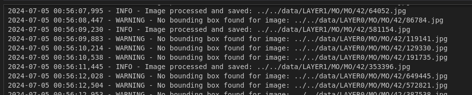

Le traitement effectue également des modifications sur l'image nécessaire au Deep Learning : redimensionnement en 224 X 224  px selon les coordonnées du rectangle de détection.

**LAYER2** : Créé suite à une augmentation des données.

Cela entraînerait une précision excellente (>0.99) dès la première époque sans optimisation, ce que nous souhaitons éviter. 

La séparation initiale garantie que les données d'entraînement et de validation sont distinctes, permettant une évaluation plus précise et une généralisation correcte du modèle.

En résumé, LAYER2 représente les données d'entraînement augmentées, tandis que les ensembles de validation et de test restent intacts et non modifiés pour une évaluation juste et précise du modèle. La figure ci-dessous montre schématiquement la structure des couches.


## Deuxième approche

Nos premiers essais montre des performances absolument incroyables, cependant, ceci s'explique par une erreur dans notre approche.

En effet, si nous procédons d'abord par l'augmentation des données puis la division, les ensembles de validation contiendrons des images trop proches de l'entrainement, car simplement modifiées par l'augmentation des données.

À ce stade, il est nécessaire d'effectuer l'inverse, en effectuant l'augmentation des donnés exclusivement sur le jeu d'entrainement divisé en amont, sans toucher au jeu de validation et de test.

Notre nouvelle arboresence se présente donc ainsi :

```bash
data
├── LAYER0
│   ├── dataset.csv
│   └── MO
│       ├── 1174
│       ├── 15162
│       ├── 1540
│       ├── (...)
│       └── 939
├── LAYER1
│   └── MO
│       ├── 1174
│       ├── 15162
│       ├── 1540
│       ├── (...)
│       └── 939
└── LAYER2
    ├── MO
    │   ├── test
    │   │   ├── 1174
    │   │   ├── 15162
    │   │   ├── 1540
    │   │   ├── (...)
    │   |   └── 939
    │   ├── train
    │   │   ├── 1174
    │   │   ├── 15162
    │   │   ├── 1540
    │   │   ├── (...)
    │   |   └── 939
    │   └── validation
    │       ├── 1174
    │       ├── 15162
    │       ├── 1540
    │       ├── (...)
    │       └── 939
    └── names.csv
```

Nous prenons à ce stade la décision de ne plus effectuer la detection des champignons via le model YoloV5 pour 2 raisons :

1. La quantitée d'image brutes perdues de 60% est trop importante.

2. Nous ne constatons pas d'amélioration des performances suite à cette detection.

Les données de notre base de donnés "MO" seront divisées un jeu d'entrainement, de validation et de test (directement opéré par le code modèle). 

Finalement, nos modèles entrainés seront évalués sur le jeu de test afin de les optimisers pour obtenir la meilleur précision possible.

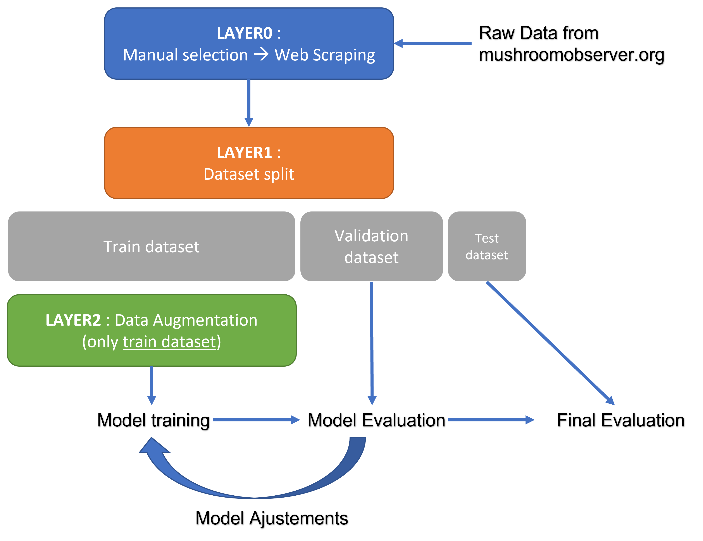

# 3. Algorithmes de Deep Learning sélectionnés et Optimisation

Les champignons présentent une diversité visuelle significative, avec des variations subtiles de forme, de couleur, et de texture. Les algorithmes de Deep Learning, notamment les **réseaux de neurones convolutifs (CNN)**, sont particulièrement efficaces pour extraire et apprendre des caractéristiques pertinentes à partir d'images, ce qui en fait l'approche idéale pour identifier correctement les différentes espèces de champignons. 

Une première expérimentation est effectuée avec un modèle naïf **LeNet**, ce dernier permet d'obtenir des résultats interessants, bien que moindre face aux méthodes de **Transfert learning**, qui offres des performances nettement supérieurs.

En effet, c'est une stratégie clé dans notre approche. En utilisant des modèles pré-entraînés sur de vastes ensembles de données comme ImageNet, nous avons pu adapter ces modèles à notre problème spécifique de reconnaissance des champignons, ce qui a considérablement amélioré les performances des modèles.

Pour cette tâche, nous avons testé plusieurs architectures : VGG16, EfficientNetB1, ResNet50.

Finalement, nous décidons de concevoir un modèle avec une architecture sur mesure: JarviSpore. 
Ce dernier est partagé sur HuggingFace: https://huggingface.co/YvanRLD

## 3.1. VGG16

VGG16 est une architecture de réseau de neurones convolutifs (CNN) développée par l'équipe Visual Geometry Group de l'Université d'Oxford. Ce modèle se distingue par sa structure simple et uniforme, composée de 16 couches profondes dont 13 couches convolutives et 3 couches entièrement connectées. Grâce à sa conception, VGG16 a démontré une grande efficacité dans la classification d'images, comme en témoigne ses performances remarquables lors de la compétition ImageNet 2014. Dans le cadre du transfer learning, VGG16 est fréquemment utilisé avec des poids préentraînés sur des ensembles de données étendus tels qu'ImageNet. Cette stratégie permet d'adapter les caractéristiques apprises par le modèle à des tâches spécifiques avec des ensembles de données plus petits, offrant ainsi une précision accrue même avec des données limitées.

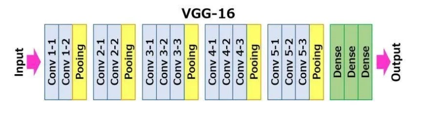

Le "16" dans VGG16 fait référence aux 16 couches qui ont des poids. Dans VGG16, il y a treize couches convolutives, cinq couches de max pooling, et trois couches denses, ce qui fait un total de 21 couches, mais seulement seize couches avec des poids, c'est-à-dire des couches avec des paramètres apprenables.

VGG16 prend en entrée un tenseur de taille 224 x 224 px avec 3 canaux RGB. La particularité de VGG16 est qu’au lieu d'avoir un grand nombre d'hyperparamètres, le modèle se concentre sur des couches de convolution avec des filtres de 3x3 avec un stride de 1, en utilisant systématiquement un padding constant et des couches de max pooling avec des filtres de 2x2 et un stride de 2.

Les couches de convolution et de max pooling sont disposées de manière cohérente tout au long de l'architecture. La couche Conv-1 possède 64 filtres, Conv-2 en a 128, Conv-3 en a 256, et Conv-4 et Conv-5 ont 512 filtres chacun.

Trois couches entièrement connectées (FC) suivent une pile de couches convolutives : les deux premières ont chacune 4096 canaux, et la troisième effectue une classification ILSVRC à 1000 classes, contenant ainsi 1000 canaux (un pour chaque classe). La couche finale est la couche softmax.

**Les entrainement réalisés**

De nombreux entrainements en transfert learning ont été réalisés en utilisant les poids imagenet disponibles directement via keras.
Ces entrainements ont permis d'expérimenter deux architectures distinctes ainsi que l'influence de certains hyperparametres :

La première série d'essai a été réalisée avec une architecture comportant une seule couche dense pour la classification. 
Les expérimentations menées consistaient à faire varier le batch size et le taux d'augmentation des données.
Les résultats semblent indiquer globalement que le batch size influence de manière importante la precision du modèle. Dans les essais menés plus la taille du batch size était importante, plus la précision était grande. Les limite de mémoire de la machine de test n'ont pas permis d'expérimenter un batch size au delà de 128.
Par ailleur on note que l'augmentation de données n'a quasiement aucune influence sur le résultats.
Cette architecture a permis d'obtenir des scores compris entre  66% et 76% de précision.

La seconde serie d'essais a été réalisée sur une architecture comportant trois couches denses, comme le modèle vgg16 original mais entrecoupées de couches dropout. Les expérimentations menées, en plus de faire varier le batch size et le taux d'augmentation des données, consistaient à faire varier le nombre de cannaux et et le taux de dropout des différentes couches.

Les combinaisons suivantes ont été testées :

* Batch size 32 et 64

* Nombre de cannaux dans les 2 premières couches de classification: 64,128,256,512,1024,2048

* Taux de dropout entre chaque couches: 0%, 10%, 20%

Cette architecture a permis d'obtenir des scores compris entre  70% et 77% de précision.

Ces entrainements ont révélé une très forte tendance du modèle à faire du sur-apprentissage sur notre jeu de données, avec une précision sur les données de test rapidement à 100% quelque soit l'architecture et les paramètres employés:

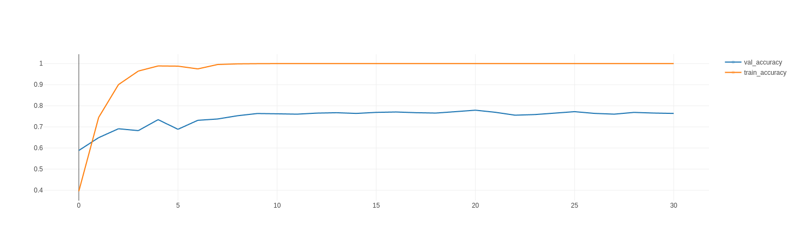

## 3.2. EfficientNetB1

### 3.2.1 Environnement de travail

L'entraînement du model EfficientNetB1 a été réalisé sur un environnement sans GPU, ce qui pose certaines contraintes en termes de performance (en particulier sur la mémoire vive). Afin d'entraîner un modèle efficace malgré ces limitations, tout en optimisant l'usage des ressources disponibles.  Une astuce fournit par Google est utilisé pour permettre un entrainement sur CPU, [en configurant la fonction expérimental AutoShardPolicy](https://www.tensorflow.org/datasets/performances).

### 3.2.2 Préparation à la prédiction

Les labels des images ont été récupérés à partir de `.class_names`, fournissant ainsi une liste ordonnée des classes.

Une fonction Python personnalisée `get_champi_name()` a été utilisée pour organiser les noms des labels en fonction des besoins spécifiques du projet pour la prédiction.

### 3.2.3 Entrainement du modèle

Les images d’entrée ont été redimensionnées en 224x224 pixels, conformément aux attentes du modèle pré-entraîné. Ce format est communément utilisé pour des modèles basés sur **ImageNet**.

Le modèle utilisé est pré-entraîné sur le dataset ImageNet, qui contient plus de 14 millions d'images et 1000 classes. Ce modèle, comprenant environ 9 millions de paramètres, permet d’obtenir une base solide pour la classification des images.

Le `batch_size` est fixé à 32, un compromis entre la vitesse d’entraînement et l’utilisation de la mémoire vive. La structure du modèle a été adaptée pour intégrer la couche finale de classification avec activation softmax, en fonction du nombre de classes cibles.

### 3.2.4 Évaluation des résultats

Sur 23  classes, le modèle a atteint une précision moyenne de 98 % lors de l'entraînement, indiquant une forte capacité à généraliser sur les données d'entraînement.

Les résultats sur les données de validation varient entre 80 % et 90 %, en fonction des ajustements apportés aux hyperparamètres. Cela montre que le modèle a une bonne capacité de généralisation, mais pourrait être affiné pour éviter le surapprentissage.

Certaines classes de champignion sont visiblement très problèmatique avec ce modèle et ne parviennent quasiment jamais à effectuer des prédictions juste.

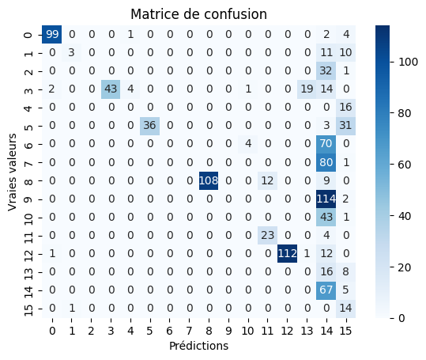

Il est noté que certaines espèces de champignons, comme par exemple le Stropharia ambigua *(classe 14)* est souvent prédite comme une autre espece, la seule nuance qui permette de différencier étant la couleur jaunâtre propre a cette espèce, nous pouvons en déduire que ce modèle n'est pas  très performant sur la prise en compte des  nuances de couleurs.

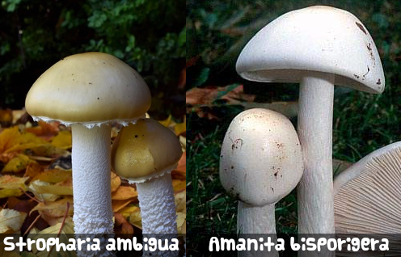

*Les Stropharia ambigua sont prédites sans prendre en compte leur couleur jaunâtre.*

### 3.2.5 Optimisation

De nouveaux essais sont effectuées sur 16 classes uniquement pour volontairement exclure les classes problématiques, avec une augmentation des donnés et un nombre d'epoch plus généreux.

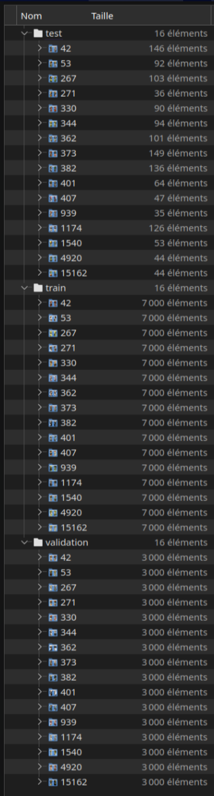

Ajout de callbacks : **ReduceLROnPlateau** pour améliorer la décente de gradient et **EarlyStopping** pour eviter le sur-entrainement.

Deux couches Dropout avec un  taux de 0.5 ont est ajoutés au réseau pour le rendre plus robuste.

Les précédents résultats montrent que les predictions sont clairement moins fiables sur les dernières classes. Ceci est causé car les données ne sont pas mélangés aléatoirement sur les différents jeux de donné. Ainsi, un Shuffle est activé pour forcer l'entrainement des données dans un ordre aléatoire.

L'entrainement s'arrête après seulement 4 epochs grâce au EarlyStopping, le sur-entrainement sur ce modèle interevient très rapidement de par sa nature, mais offre de bonnes perfomances.

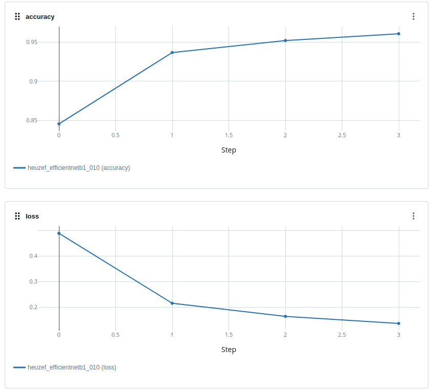

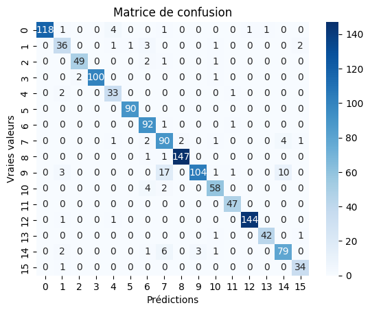

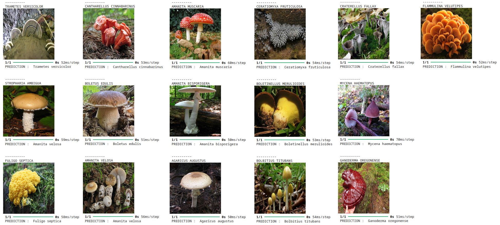

### 3.2.6 Conclusion

L'entraînement du modèle EfficientNetB1 sur un environnement sans GPU a permis d'obtenir des résultats satisfaisants malgré les limitations matérielles. En optimisant l'utilisation des ressources, notamment grâce à l'astuce de la configuration `AutoShardPolicy`, le modèle a pu tirer parti d'un environnement CPU tout en maintenant de bonnes performances.

L'utilisation d'un modèle pré-entraîné sur ImageNet fourni une base solide pour la classification. De plus, la gestion personnalisée des labels a permis une adaptation efficace aux besoins spécifiques du projet. Nous constatons cependant que ce modèle n'est malheureusement pas très performant lorsqu'il s'agit de nuancer les couleurs des différentes éspèces.

Les performances du modèle ont montré une précision d'entraînement remarquable à 96% et une précision de validation de 86%.

Sur le jeu de test, les scores sont cependant plus interessants :

| Accuracy        | Precision       | Recall          | F1-score        |
| --------------- | --------------- | --------------- | --------------- |
| 0.9286764705882 | 0.9336224871829 | 0.9286764705882 | 0.9290201971718 |

Bien que ces résultats soient encourageants, ils révèlent également des marges de progression, notamment pour affiner les scores de précision sur le jeu d'évaluation.

Ces conclusions ouvrent la voie à des pistes d'amélioration, telles que l'optimisation des hyperparamètres et une meilleure gestion des données pour minimiser le risque de sur-apprentissage, EfficientNetB1 étant particulièrement senssible au sur-entrainement.

Bien que l'entrainement sur CPU est satisfaisant, effectuer ces expérimentations avec un GPU devrais offrir un gain de vitesse.

## 3.3 ResNet50

Après avoir exploré EfficientNetB1, nous avons décidé de tester ResNet50. Cette architecture se distingue par ses blocs résiduels qui facilitent l'entraînement de réseaux très profonds en ajoutant des connexions directes entre les couches. Pour la reconnaissance des champignons, ResNet50 peut être particulièrement intéressant en raison de sa capacité à extraire des caractéristiques complexes tout en maintenant une efficacité computationnelle, ce qui est crucial pour des tâches de classification fines comme celle-ci.

### 3.3.1. Modèle de base

Le modèle est basé sur **ResNet50**, pré-entraîné sur le jeu de données **ImageNet**. Nous avons enlevé la partie supérieure du modèle (le "top") pour adapter le réseau pré-entraîné à notre tâche spécifique de reconnaissance des champignons. La partie supérieure d'un modèle pré-entraîné est généralement conçue pour des classes spécifiques du jeu de données d'origine, comme ImageNet. En retirant cette partie, nous pouvons ajouter des couches adaptées à notre propre ensemble de classes, ce qui permet au modèle de s'ajuster aux spécificités de notre tâche de classification multiclasse. Nous avons ajouté une couche de **GlobalAveragePooling2D** suivie d'une couche **Dense** de 1024 neurones (taille couramment utilisée dans de nombreux réseaux de neurones pour les couches cachées) avec activation **ReLU**. La dernière couche de sortie est une couche **Dense** avec autant de neurones que de classes dans les données, utilisant une activation **softmax** pour la classification multiclasse.

Les couches du modèle pré-entraîné ResNet50 ont été gelées (non-entraînables) pour conserver les poids appris précédemment et éviter de modifier ces paramètres durant l'entraînement. Le modèle a été compilé avec l'optimiseur **Adam** et une faible valeur d'apprentissage (learning rate = 1e-4). La perte utilisée est **categorical crossentropy**, avec une métrique d’évaluation sur la **précision**.


**Résultats** obtenus :

Précision d'entraînement : Le modèle montre une précision qui commence à 71 % et atteint presque 100 % (99,96 %) à la fin de l’entraînement. Cela montre que le modèle apprend très bien les données d’entraînement, mais cela suggère aussi un risque de **surapprentissage** (overfitting).

Précision de validation : La précision de validation commence relativement élevée à 81 %, mais fluctue au fil des époques, se stabilisant autour de 84 %. Le modèle généralise relativement bien, mais ne montre pas d'amélioration significative après quelques itérations, suggérant un plateau dans l'apprentissage.

Perte de validation : La perte de validation diminue légèrement au début, mais à partir de la cinquième époque, elle commence à augmenter. Cela reflète encore une fois un surapprentissage, car la perte d’entraînement continue de baisser tandis que la perte de validation augmente. Cela signifie que le modèle se spécialise trop sur les données d’entraînement et ne parvient pas à bien généraliser sur de nouvelles données.

### 3.3.2. Modèles ajustés

1) **Ajout de Dropout (0.5)**
   Le Dropout a été ajouté après la couche de GlobalAveragePooling2D et après la couche Dense, avec un taux de 0,5. Cela permet de réduire le surapprentissage (overfitting) en désactivant aléatoirement 50 % des neurones pendant l'entraînement. Cela rend le modèle moins dépendant de certains neurones spécifiques et améliore sa capacité de généralisation.
   
   **Régularisation L2 (0.001)**
   Une régularisation L2 a été appliquée sur la couche Dense. Cette technique pénalise les poids excessivement élevés, contribuant à réduire le surapprentissage en encourageant des poids plus petits. Cela aide à créer un modèle plus stable et capable de mieux généraliser aux nouvelles données.
   
   **Résultats** : 
   La précision d'entraînement atteint 77 %, tandis que la précision de validation passe de 70 % à 80 % avec une perte de validation en baisse constante, montrant que la régularisation par Dropout et L2 aide à mieux généraliser et à réduire le surapprentissage.

2) **Unfreezed layers**
   
   Les 10 dernières couches du modèle de base ResNet50 ont été "défigées" pour être entraînables, ce qui permet à ces couches d'affiner leurs poids pendant l'entraînement. L'apprentissage est effectué avec un taux d'apprentissage plus bas (1e-5) pour éviter une mise à jour trop rapide des poids, et ce sur 10 époques.
   
   **Résultats** : Le surapprentissage est probable, car l'exactitude en entraînement est très élevée, mais l'exactitude en validation stagne et la perte en validation ne diminue pas significativement.

3) **Régularisation et Dropout** :  Deux couches de Dropout à 50% et la régularisation L2 sont ajoutées pour limiter le surapprentissage, en réduisant la dépendance du modèle à certaines connexions spécifiques.
   
   **Optimisation de l'entraînement**
   **Early Stopping** : Le modèle arrête l'entraînement si la perte en validation ne s'améliore plus après 3 époques, tout en restaurant les meilleurs poids, évitant un surapprentissage inutile.
   
   **Réduction du taux d'apprentissage (ReduceLROnPlateau)** : Ce callback diminue progressivement le taux d'apprentissage si la validation stagne, permettant des ajustements plus fins dans les dernières étapes d'entraînement.
   
   **Augmentation des epochs** : 
   Le nombre d'époques est passé à 50, en combinaison avec les mécanismes de contrôle du surapprentissage, pour permettre au modèle d'explorer un espace plus large de solutions tout en conservant une bonne généralisation.
   
   **Résultats** : L'exactitude d'entraînement dépasse 94%, mais l'exactitude de validation progresse lentement et se stabilise, indiquant un possible surapprentissage. La perte d'entraînement diminue, tandis que la perte de validation augmente après quelques époques, renforçant l'hypothèse de surapprentissage. Le taux d'apprentissage, initialement à 1e-5, a été réduit à 2e-6 après la 7e époque, montrant que le modèle a atteint un plateau tôt.

4) **Augmentation du taux de dropout** à 0,7 pour réduire la dépendance excessive aux neurones spécifiques et prévenir le surapprentissage. 5 couches de ResNet50 sont désormais dégelées pour affiner davantage l'apprentissage. 
   Le **callback EarlyStopping** a une patience augmentée à 5 pour permettre au modèle de continuer l'entraînement plus longtemps avant d'arrêter si la validation ne s'améliore pas, et le **ReduceLROnPlateau** réduit le taux d'apprentissage plus progressivement, avec un plancher fixé à 1e-6.
   Augmentation de la **régularisation L2** dans la couche de sortie à 0.01 pour mieux contrôler le surapprentissage.

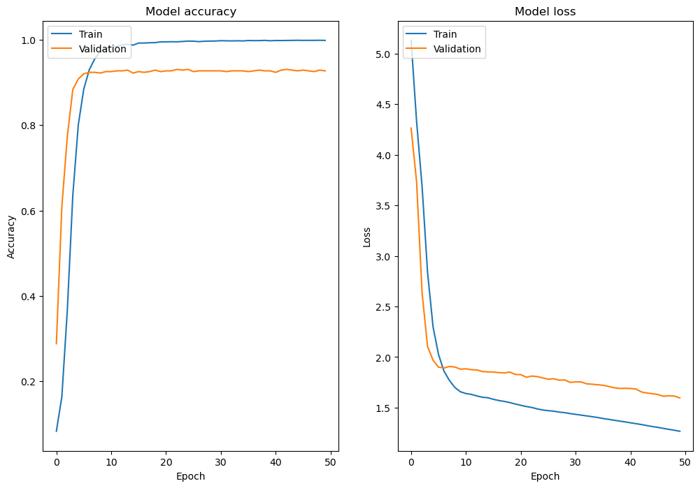

**Résultats** L'exactitude d'entraînement atteint 95%, mais la précision de validation stagne autour de 80%, suggérant un surapprentissage. La perte de validation diminue au début mais augmente ensuite, ce qui confirme également un surapprentissage. Le taux d'apprentissage réduit considérablement après la 12e époque, montrant que le modèle a atteint un plateau précoce dans l'entraînement.

### Conclusion

Malgré une haute précision d'entraînement (95%), le modèle montre encore du **surapprentissage**, avec une précision de validation stagnante autour de 80% et une perte de validation croissante.

Causes possibles :

- Le modèle pré-entraîné sur ImageNet peut ne pas capturer suffisamment les caractéristiques spécifiques des champignons.
- Les données d'entraînement pourraient être insuffisantes pour une généralisation efficace.
- Le taux d'apprentissage pourrait ne pas être optimal pour ce problème spécifique.

Prochaines étapes :

- Augmenter la taille et la diversité des données d'entraînement sur les champignons.
- Ajuster ou simplifier l'architecture du modèle.
- Ajouter des techniques de régularisation supplémentaires.
- Expérimenter avec des modèles spécifiquement entraînés sur des données de champignons ou utiliser des techniques de transfert learning adaptées.

## 3.4. ResNet18

ResNet18 est comme ResNet50 un réseau de neurones convolutifs utilisant des connexions résiduelles, mais avec une profondeur de 18 couches seulement.

Les essais menés avec ResNet18 ont été immédiatement concluants avec un score de précision d'environs 97% sur notre dataset (23 classe avec en moyenne 166 images par classe).

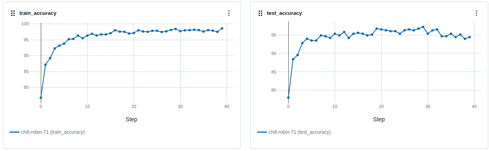

Différents essais on permis d'estimer le nombre d'images necessaires pour obtenir un niveau de précision satsfaisant. Ainsi on constate qu'avec un dataset comprenant seulement 80 images par classe on atteint une précision de 97%. Avec seulement 30 images par classe on reste au dessus de 90% de précision, et même avec seulement 10 images par classe on reste au dessus de 80% de précision.

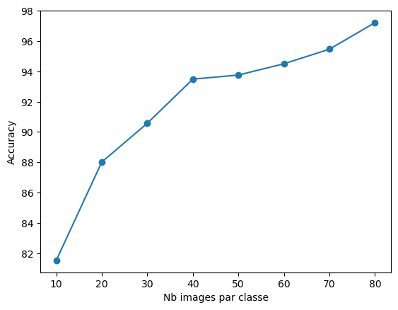

## 3.5 JarviSpore

Suite aux résultats mitigés sur le transfert Learning, nous avons pris l'initiative de créer un modèle de zéro avec comme support les cours DataScientest et des livres.

Nous avons investi dans un PC avec carte graphique RTX 3090 disposant de 24 Go de VRAM. Notre PC dispose de 192 Go de RAM. Processeur i9 14900k.

Nous avons ensuite pris le parti de tester dans un environnement WSL2. Cela nous permettait d'utiliser les dernières versions de TensorFlow, Cuda, Cudnn et Keras.

Après l'installation, nous avons construit le modèle dans VSCode, mais lors des entraînements, des problèmes de mémoire nous ont compliqués la tâche.

Nous avons déployé un environnement sous Windows en utilisant d'anciennes versions de TensorFlow, Cuda …

Pour assurer la compatibilité des bibliothèques utilisées et de leurs versions, car la compatibilité TensorFlow sous Windows s'arrête à la version 2.10 :

```
numpy : 1.26.4
tensorflow : 2.10.0
matplotlib : 3.9.2
scikit-learn : 1.5.2
PIL : 10.4.0
cv2 : 4.10.0
pandas : 2.2.3
```

Ce modèle effectue l'entraînement, l'évaluation et l'interprétation d'un modèle de réseau de neurones convolutif (CNN) pour une tâche de classification d'images. Voici les différentes étapes et le processus utilisés :

1. Importation des Bibliothèques  
   Nous commençons par importer les bibliothèques nécessaires pour la manipulation des données, l'entraînement du modèle, l'évaluation et la visualisation des résultats. Les bibliothèques incluent TensorFlow pour la construction du modèle, NumPy pour les calculs numériques, Pandas pour la gestion des données et OpenCV pour le traitement des images.

2. Extraction des Versions des Bibliothèques  
   Nous vérifions les versions des bibliothèques utilisées afin d'assurer la compatibilité des versions.

3. Chargement des Datasets (structurées et non structurées)  
   Nous définissons les chemins pour les datasets d'entraînement, de validation et de test. Nous utilisons la fonction image_dataset_from_directory pour charger les images en les redimensionnant à la taille (224, 224) avec un batch size de 32 images. Les ensembles de données sont ensuite configurés pour être mis en cache en mémoire vive, préchargés et optimisés.

4. Chargement des Classes  
   Nous chargeons les noms des classes à partir d'un fichier CSV (API MushroomObserver) pour obtenir la liste des classes disponibles. Cela permet au modèle d'associer les indices des classes avec les noms réels lors de l'affichage des résultats.

5. Construction du Modèle Convolutionnel  
   Nous construisons un CNN personnalisé avec plusieurs couches de convolution suivies de la normalisation par lots (Batch Normalization), du sous-échantillonnage (MaxPooling) et d'une couche de sortie utilisant softmax pour la classification des 23 classes. Les couches de convolution permettent d'extraire les caractéristiques des images, tandis que les couches denses à la fin effectuent la classification.

6. Compilation du Modèle  
   Le modèle est compilé avec l'optimiseur Adam et la fonction de perte sparse_categorical_crossentropy, adaptée à la classification multi-classes avec des étiquettes sous forme d'entiers.

7. Ajout de l'Early Stopping et du Model Checkpoint  
   Nous configurons des callbacks pour arrêter l'entraînement si la précision de validation n'augmente plus après 5 époques (early stopping) et pour sauvegarder le meilleur modèle lors de l'entraînement (ModelCheckpoint).

8. Gestion du Déséquilibre des Classes  
   Nous vérifions le déséquilibre des classes dans l'ensemble d'entraînement. Si certaines classes sont moins représentées, nous utilisons des pondérations de classe (class_weight) pour accorder plus d'importance aux classes sous-représentées afin d'améliorer la généralisation du modèle.

9. Entraînement du Modèle  
   Le modèle est entraîné sur 20 époques, en utilisant les pondérations de classe pour mieux gérer les déséquilibres. Les callbacks configurés permettent de surveiller la performance et de sauvegarder le meilleur modèle.

10. Génération de la Matrice de Confusion  
    Après l'entraînement, nous générons une matrice de confusion sur l'ensemble de validation pour évaluer la capacité du modèle à classifier correctement les images. La matrice de confusion est affichée avec les noms des classes pour faciliter l'interprétation des résultats.

11. Visualisation des Courbes d'Entraînement  
    Nous affichons les courbes de précision et de perte pour les ensembles d'entraînement et de validation, ce qui nous permet de visualiser l'évolution des performances du modèle pendant l'entraînement.

12. Sauvegarde du Modèle et Métadonnées  
    Nous sauvegardons le modèle entraîné au format .keras ainsi que les métadonnées (date d'entraînement, précision sur l'ensemble de test, nombre d'époques). Cela permet de documenter le modèle pour un suivi ultérieur.

13. Test et Évaluation du Modèle sur l'Ensemble de Test  
    Nous testons le modèle sur le jeu de données de test pour obtenir la précision finale et évaluer sa performance générale.

14. Affichage Grad-CAM  
    Nous implémentons Grad-CAM pour visualiser les activations des couches de convolution du modèle. Cette technique permet d'afficher les régions de l'image qui ont le plus contribué à la décision du modèle. Les résultats sont affichés pour cinq images aléatoires du jeu de test.

Résultats Attendues  

- Précision du Modèle : La métrique mesurée est la précision, elle permet de mesurer le pourcentage de classifications correctes effectuées.  
- Interprétabilité avec Grad-CAM : Les heatmaps générées par Grad-CAM doivent indiquer les parties pertinentes de l'image, ce qui aide à comprendre le fonctionnement du modèle.  
- Généralisation : Avec l'utilisation des callbacks et des pondérations de classe, le modèle doit éviter le sur-apprentissage et bien généraliser sur les données de validation et de test.

Ces étapes permettent de construire un modèle performant pour la classification d'images, tout en prenant en compte les déséquilibres de classe et en offrant des outils d'interprétation des résultats.

Lien vers le modèle sur Hugging Face : https://huggingface.co/YvanRLD/JarviSpore

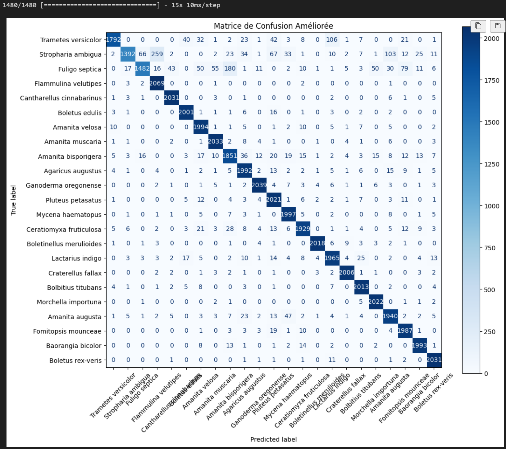
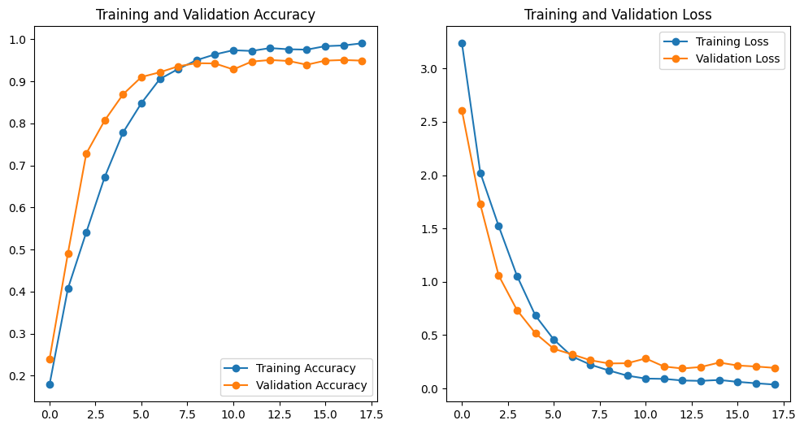
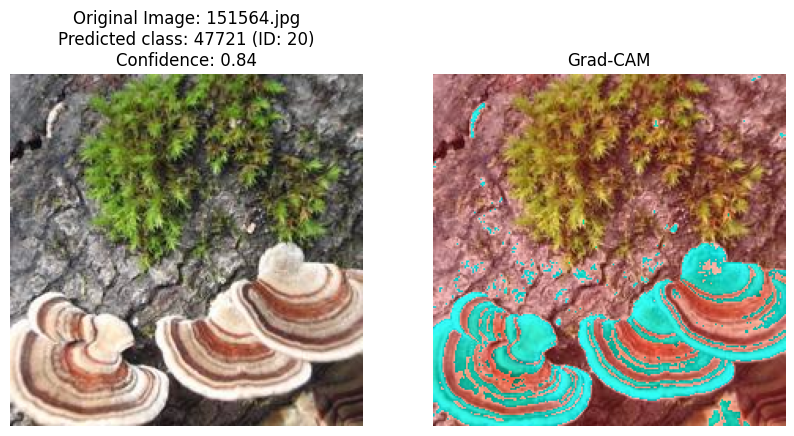

# 4. Interprétation des résultats avec Grad-CAM

Pour mieux comprendre les résultats et les décisions prises par les algorithmes, nous avons utilisé **Grad-CAM** (Gradient-weighted Class Activation Mapping), une technique puissante d'interprétation des modèles de deep learning, en particulier pour la classification d'images. Cette méthode permet de visualiser les régions d'une image qui influencent le plus les décisions d'un modèle. En générant des cartes thermiques (heatmaps) superposées sur les images d'entrée, Grad-CAM met en évidence les caractéristiques jugées essentielles par le modèle pour ses prédictions.

Pour créer ces cartes thermiques, on commence par calculer les gradients associés à la classe prédite, en les reliant aux cartes de caractéristiques issues de la dernière couche de convolution. Ces gradients sont ensuite moyennés pour obtenir une vue d'ensemble, qui sert à ajuster les cartes de caractéristiques, mettant ainsi en lumière les zones les plus importantes pour la classification.

Avec Grad-CAM, nous pouvons mieux comprendre les performances de nos modèles en analysant visuellement leurs points d'attention. Cette approche nous aide à identifier les forces et les faiblesses des modèles, à déceler d'éventuels biais et à approfondir notre compréhension des décisions prises par les algorithmes.

Le graphique ci-dessous illustre des exemples de cartes thermiques obtenues via EfficientNetB1 et ResNet50 pour quatre classes différentes de champignons.

 

Les "zones chaudes" (zones rouges et jaunes des cartes thermiques) indiquent les régions sur lesquelles le modèle se concentre. En général, ces zones chaudes correspondent à certaines parties du champignon, mais la zone de concentration varie selon la classe de champignon (par exemple, la tige par rapport à la tête du champignon, le bord de la tête, etc.). Il est intéressant de noter que, pour l'image contenant deux champignons, ResNet50 performe mieux en identifiant les deux, tandis qu'EfficientNet se concentre principalement sur un seul champignon.
Cependant, pour la photo avec la présence de la main, ResNet50 était complètement perdu et ne se concentrait pas du tout sur le champignon, tandis qu'EfficientNet l'identifiait mieux. 

En somme, ces résultats soulignent l'importance d'une analyse approfondie pour mieux comprendre les performances de chaque modèle dans des situations variées.

# 5. Conclusion

## 5.1 Comparaison des resultats

Les différents essais réalisés ont mis en évidence d'importantes différences de résultats obtenus avec divers modèles sur un même jeu de données. Alors que certains modèles, comme VGG16, affichent des limites significatives pour ce cas d'utilisation, d'autres, tels que ResNet18, ont démontré d'excellentes performances.

En poursuivant notre analyse, nous avons également comparé ResNet18 et ResNet50. Cette comparaison montre qu'un modèle plus profond n'est pas toujours synonyme de meilleures performances ; au contraire, sur un petit jeu de données, un modèle plus complexe peut s'avérer moins performant.

Dans le cadre de notre projet, nous avons intégré l'approche MLflow pour améliorer le suivi et la gestion de nos expériences en apprentissage automatique.

Ce dernier est utilisé pour tracer chaque étape du processus expérimental, notamment les paramètres, les métriques, et les artefacts des modèles.

Nous avons configuré un serveur de tracking, défini un projet spécifique pour organiser nos expérimentions.

Cette intégration permet de centraliser et comparer les métriques et de faciliter le déploiement ultérieur des modèles retenus.

Ainsi, nous pouvons suivre de manière systématique et efficace les progrès réalisés dans notre projet. Les captures suivantes résument donc les résultats de l'ensemble du projet :

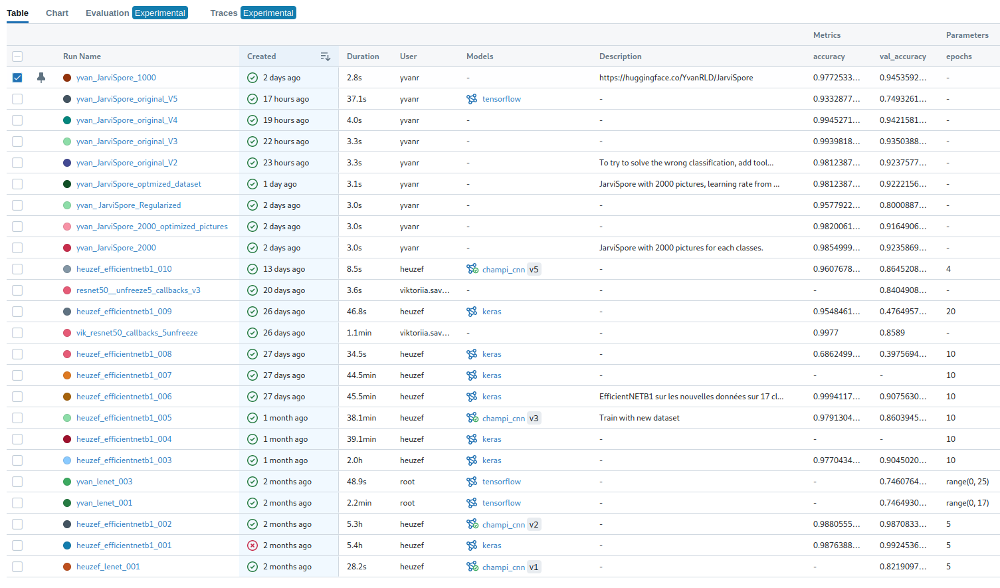
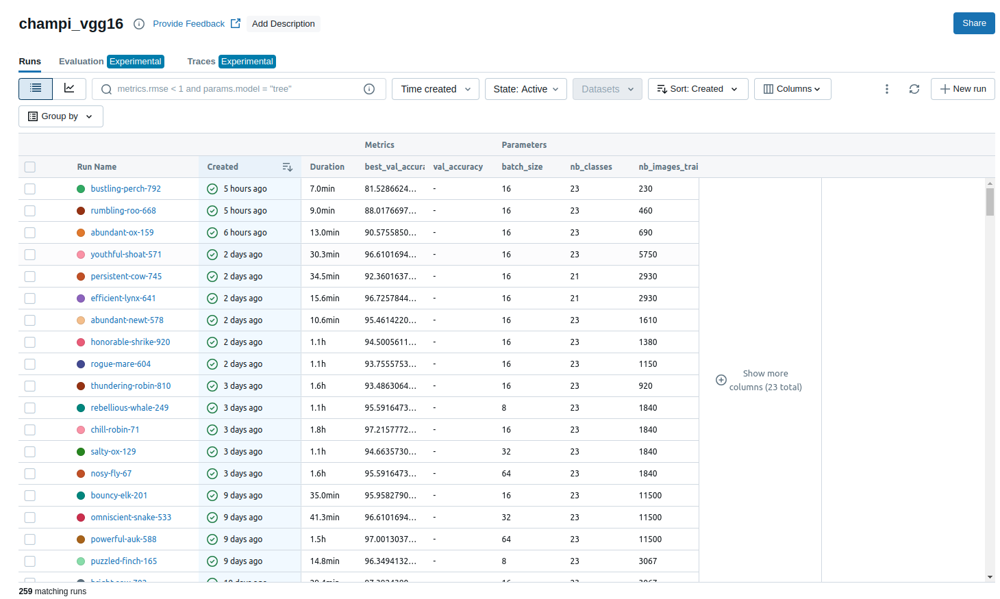

## 5.2 Interpretabilité

Les différentes évaluation des modèles effectués sur des données de tests montrent que de façon global, les modèles ont tous tendance à effectuer de la sur-interprétation et gèrent particulièrement mal les couleurs des champignons. 

En effet les méthodes Grad-Cam permettent de visualiser cette tendance à prendre en compte des zones précises, sans se concentrer sur les zones très colorés. La couleur est pourtant l'un des points les plus importants, les modèles montrent tous de grandes faiblesse pour différencier deux champignons physiquement identique avec la couleur comme seul élément de différenciation ou encore de simplement localiser un champigon, même de couleur vive, si le fond de la photo contient des éléments avec une forte luminosité proche du blanc.

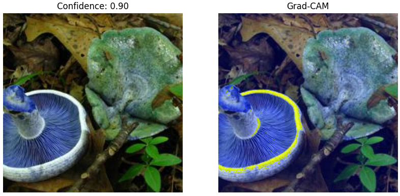

## 5.3 Technique

Nous pouvons noter que si les modèles avec une architeture les plus basiques (Lenet) offre des resultats très moyen, ceux en transfert learning offrent cependant des resultats performants même si rapidement sujet à un sur-apprentissage malgrès nos essais avec différentes technique d'optimisation.

Nous concluons sur le fait que la conception d'un modèle sur-mesure, avec une architecture complexe, bien que très fastidieux, permet d'obtenir des métriques et rapports de classification plus performant à tout les niveaux.

En effet, décision est prise d'implémenter un modèle nommé JarviSpore, solution modulable au fur et à mesure de l'avancée de nos connaissances. Celui-ci est arrivé à maturité et présente des performances supérieures.

# 6. Pour aller plus loin

## Modèles Open-Source

L'utilisation de modèles plus récents accessible sur HuggingFace nous permettrais très surement  d'obtenir encore de meilleurs performance de précision.

Nous expérimentons l'utilisation d'un modèle communautaire de classification pré-entrainé sur 100 espèces de champignons russe.

Ce modèle, partagé par Dmytro Iakubovskyi, est entrainé sur 233480 images et se base sur l'architecture ViT (85.9M de paramètres).

[🤗 Mid-ViT par dima806 - HuggingFace](https://huggingface.co/dima806/mushrooms_image_detection)

## Réseaux Kolmogorov-Arnold

Les MLP (réseaux de neurones multicouches), bien qu'utilisés dans de nombreux contextes, sont souvent sujets à l'overfitting en raison de leur grande flexibilité, et comportent de nombreux paramètres difficiles à interpréter, ce qui limite leur utilité dans certaines applications. 

Récemment, les réseaux Kolmogorov-Arnold (KAN) ont été proposés comme une alternative prometteuse (article : https://arxiv.org/abs/2404.19756, GitHub : https://github.com/KindXiaoming/pykan). 

Contrairement aux MLP, qui utilisent des fonctions non linéaires fixes comme ReLU ou Tanh, les KAN exploitent des B-splines, des polynômes par morceaux, pour modéliser les données de manière plus souple et ajustée. Cela permet d'améliorer l'interprétabilité des modèles et de réduire le nombre de paramètres, rendant les KAN plus efficaces et potentiellement moins sensibles à l'overfitting.

Cependant, bien que les KAN présentent de nombreux avantages théoriques, ils restent instables, avec des résultats sensibles aux hyperparamètres choisis, ce qui nécessite des ajustements soigneux pour chaque tâche. 

Pour les prochains tests, il sera crucial d'explorer davantage cette nouvelle architecture, de tester son potentiel de généralisation sur des données variées, et d'évaluer dans quelle mesure elle peut remplacer les MLP dans des architectures complexes.
